## 漫谈Android组件化
本文将先从Java语言的局限性说起，聊聊模块这一特殊的单元，随后阐述组件化思想的来龙去脉，并在最后介绍知名的Android组件方案。
### Java语言特性
在Java语言中，有两个非常重要且被广泛使用的特性，分别是classloader和四大修饰符关键字。
- 使用classloader来加载类。不同classloader中的类是互相隔离的。通常，每个工程会有一个自己的classloader。
- 使用public和protect关键字来管理包之间的代码。public代表全局可见,protect表示子类可见。
- 使用default关键字来约束包内的代码，只有同一个包内的类之间代码互相可见。
- 使用private关键字来约束类内部的代码，只有本类的内部的代码才可见。

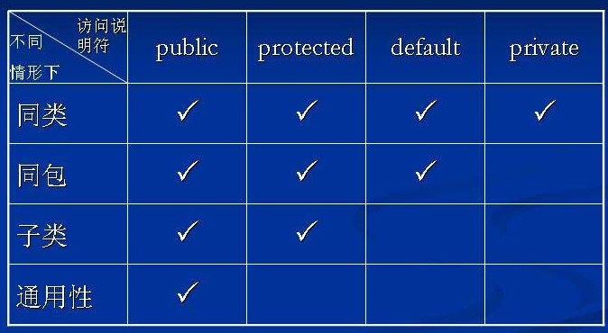  

基于这两个特点，Java应用的工程结构可以被划分为三种基本单位，自上而下依次是应用(application)、包(package)、类(class)。Java语言通过classloader的加载机制来隔离类，并通过四大修饰关键字来管理代码之间的可视关系。

不过，随着工程水平的进步，大型项目日益增多，基于Java语言特性的三种基本单位变得有些不太够用了。很多时候会出现这样一种情况，一个人负责好几个包的代码，但同时又有多个人协作同一个工程。为此，程序员们人为的在应用和包之间加入了第四个结构上的概念——模块。  
在一个大规模的应用/系统中，模块成为了真正被管理和部署的单元。每个模块一般都会有自己的owner，并进行相对独立的迭代和演进。以模块为核心的进行人员分配和管理，正是现在大多数应用开发所遵循的原则。

### Android工程结构
打开Android Studio，我们会发现Android工程已经提供了四个层级的管理单元：分别是工程(project)、模块(module)、包(package)和类(class)。  

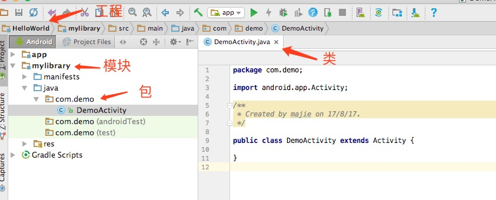  

在一个大的Android工程中，
- 模块是基本的功能单元。因为，模块间通常会按照功能进行划分，每个模块都会有自己比较特定且专一的功能。
- 模块是独立的迭代单元。因为，模块通常会被进行细致的设计和划分以保证模块间的关系通常较为独立，可以独立更新而不影响其他业务。
- 模块是基础的维护单元。因为，模块通常会由特定的一个人或一小组人负责。  

从早期的maven到现在的gradle，都是将模块视为基础单元的。下面这幅图解释了这四种单元的关系。我们可以看出模块的意义何在。

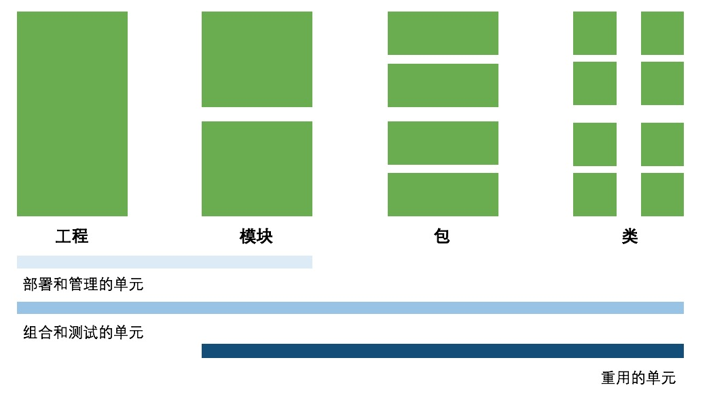

### 模块的困境
从概念上，模块是很好理解的，也很容易被划分出来。然而，Java语言不具备原生支持模块概念的能力。因此，在实际工程中，我们经常会出现模块间耦合度过高，互相甚至循环依赖，无法独立迭代，维护困难等问题。  

假设有一个App，会大量的使用到文件下载的功能。对于一个稍大的团队，很可能会这么去做：
- 先划分出一个单独的文件下载模块A，并指派专人负责其代码，以方便复用和维护。
- 为了方便别人调用，A模块实现了下载的统一管理类DownloadManager，提供了download(...)的方法，并用文档标明了使用方法。
- 因为下载本身是一系列的步骤，因此需要一系列的Helper类。比如，有个DownloadHelper类，提供了一个public方法startDownload(...)。还有一个Checker类，提供public的方法canDownload(...)。
- 模块B需要调用A的功能时，查看了A模块提供的说明文档。因此正确使用了DownloadManager.download(...)方法。

目前看来，模块的思路很清晰准确，一切都运转良好。未来，当模块A想要修改下载的具体实现时，只要保持Manager类中方法的稳定就能保持修改对于B模块来说是透明的。但是这样一种理想情况的出现，依靠的不是模块A而是模块B。为什么这么说呢？让我们来考虑下面这样一个场景：
- 有个模块C，也想调用模块A的下载功能，也是需要先用check一下可行性，然后再去下载。
- 模块C的负责人，可能没有找到模块A的文档，又可能没有看懂，又或者压根没有时间去看。他只是默默在IDE中敲着代码，发现有Checker这样一个类，而且这个类提供了canDownload(...)方法。这个方法是符合自己需要的。
- 于是模块C中关于下载的代码，写成了先判断Checker.canDownload(...)，然后再调用DownloadManager.download(...)。
- 之后，有越来越多的模块都在引用模块A的代码，每一个模块都在按照自己对模块A的理解调用着下载相关的逻辑。。。

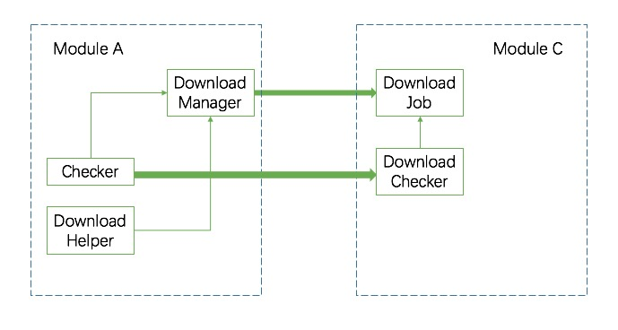

因此，我们发现，如果模块C不完全遵守规范的话，就会出现一些问题。未来，当模块A想要调整完善下载逻辑的时候，接到了一堆模块的投诉：
- 模块A的想法是，我不但做好了统一的封装，还写了文档特意说明了调用下载模块只需要调用DownloadManager，其他的类不是给你们用的。
- 其他模块的想法则是，反正你的改动break了我的下载功能，你得负责。你不想暴露的方法，你private掉啊，我反正调用的可都是public的方法。  

现实生活中，在稍微大一点的项目中，类似的事情几乎每一天都在上演。越是基础的公共类越是有更高的几率遇到这种事情，任何一方其实都没有明显的过错，但是最终却造成了一个极其尴尬的局面。代码的维护和更新成本变得极其的高昂，某一处小小的改动，都需要遍历所有的调用，一一排查其影响。  
深究其原因，Java语言提供的四大修饰关键字只是用来进行包和类之间的代码管理的，对于模块这个人为划定的概念，Java语言本身无法轻易解决。

### 模块化思路
为了处理这种尴尬的情况，降低模块间的耦合程度，自然而然会想到的方法就是设计一个“模块管理”模块进行解耦合。即设计一个中心式的ModuleManager，使其他所有模块依赖且仅依赖于它。从而切断模块间的互相耦合，形成一个星形的拓扑结构，并通过它集中进行模块间的消息转发。

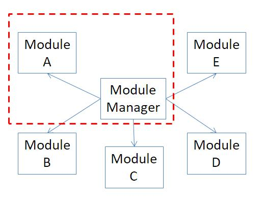

从图中来看，感觉上效果不错，对于大多数项目来说也够用了。但是，实际工程中，图中的红框所示的部分（即某个模块加上管理模块）其实是运行不起来的，或者说，即使运行起来，也是无法测试和验证的，因为功能本身不完整。因此，需要在此基础上做出改进，划分基础模块和功能模块。将基础模块和管理模块默认打包在一起，成为了一个平台工程（壳工程）。功能模块依赖这个壳工程运行，就能够单独的运行和测试了。对于大部分的Android项目，代码的组织就是这样子的。

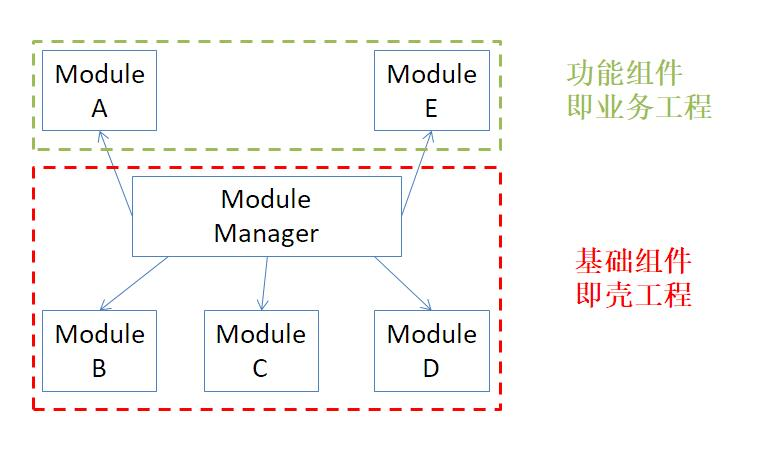

但是，这样的设计无法从技术角度保证业务模块不去直接调用基础模块中的方法，又重新把Java语言没法隔离模块的问题给暴露出来了。所以，人们需要寻找一种设计，这种设计既可以从平台+业务的角度划分代码模块，又可以真正的让模块间互不可见。  

于是，OSGI规范登场了，其大致特点如下：
- OSGI使用了ClassLoader的隔离效果来进行模块间的隔离，即对于每一个模块都使用单独的ClassLoader进行加载。由此，各个模块间的代码就是互相不可见的了。在OSGI中，模块一般被称为Bundle。
- 每个Bundle使用的ClassLoader都是OSGI框架所使用的ClassLoader的子类。因此，每个Bundle能调用到的代码就是自身的ClassLoader和OSGI的ClassLoader内的代码，也就是每个模块只能看见自己和框架层的代码。
- Bundle可以指定自己的一部分代码注册到框架层中，即使用框架的ClassLoader去加载某些类。相当于将这部分代码暴露给了其他Bundle，也就是起到了Bundle的API的作用。在OSGI中，这些暴露出来的功能被称为服务，一般是一套接口。

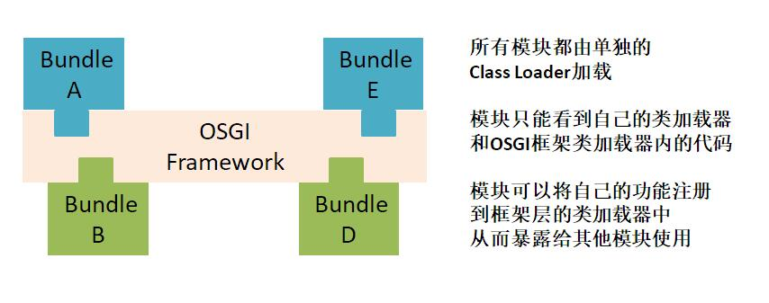

OSGI在很多大型的Java项目中都有应用，比如Spring和Eclipse。其最大特点是巧妙的利用了ClassLoader的隔离性解决了模块间的代码隔离问题，并依旧保证了模块间简洁的通信方式，从本质上解决了模块的相互引用和耦合。另一方面，框架带来的一个巨大好处是动态的加载或卸载模块及服务。从而不需要一次性的加载起所有模块来，这在很多场景下都是非常有价值的。
### Android组件化的一种实现
在介绍完了一堆背景概念之后，我们终于可以看看Android组件化了。首先，我们可以使用OSGI的思想来完成模块间的隔离和管理。其次，我们需要使用Android插件化的技术来完成类的热加载，以实现框架的动态化。

这里要介绍的是手淘的开源Android组件化框架atlas。atlas是一个Android客户端容器化框架，主要提供了组件化、动态性、解耦化的支持。支持工程师在工程编码期、Apk运行期以及后续运维修复期的各种问题。
- 在工程期，实现工程独立开发，调试的功能，工程模块独立。
- 在运行期，实现完整的组件生命周期的映射，类隔离等机制。
- 在运维期，提供快速增量的更新修复能力，快速升级。  

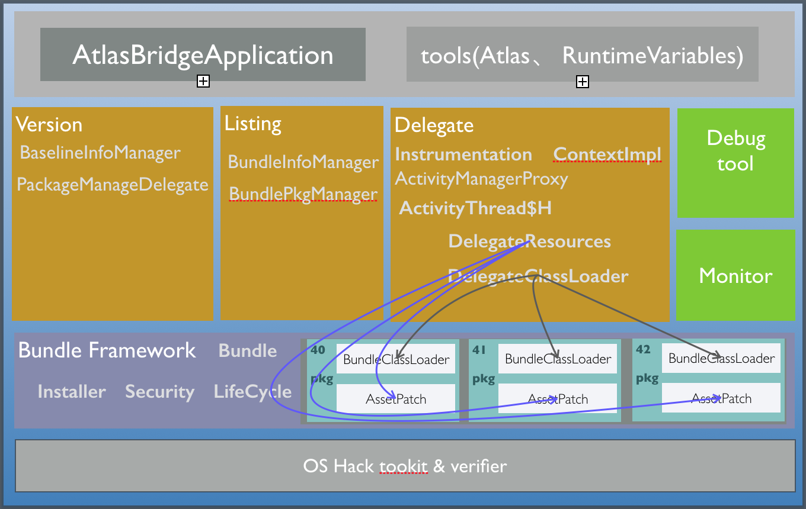

atlas的整体设计可以为分为五层：
1. 第一层称为Hack层，包括OS Hack toolkit。这里对系统能力做一些扩展，然后做一些安全校验。
2. 第二层是Bundle Framework，就是容器的基础框架（对应OSGI的FrameWork)，提供Bundle管理、加载、生命周期、安全等一些基本能力。
3. 第三层是runtime层，包括服务管理，即把所有的Bundle和它们的能力列在一个清单上，在调用时方便查找，并对所有Bundle的版本进行管理。再就是代理，这就是和业界一些插件化框架机制类似的地方，我们会代理系统的运行环境，让Bundle（即独立的小apk）可以动态被加载起来并运行在容器框架上。最后，还有一些调试和监控工具。
4. 第四层是业务层，向业务方暴露了一些接口，如框架生命周期、配置文件、工具库等。
5. 最上面一层是应用接入层，也就是业务代码了。  

来看看github上的代码结构吧。非常非常概括的说法是，atlas = OSGI+Android插件化。核心的代码是四个部分，即core,aapt,update和gradle-plugin。很显然，核心的代码就是core工程了。

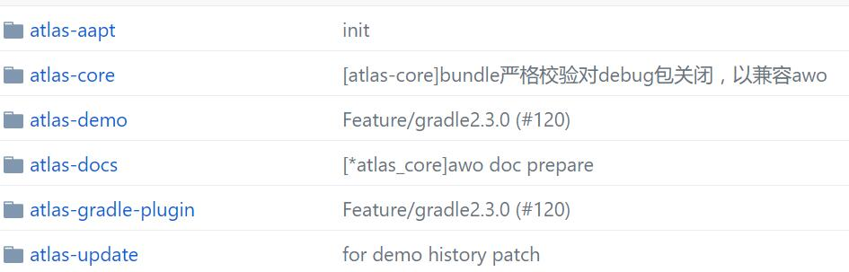

core的代码分为了好几部分。其中一部分就是一套基于Android的OSGI的实现，代码分散在了不少包里，比如taobao.atlas.bundleInfo，taobao.atlas.framework等等，其中有一个包的包名甚至很耿直写成了org.osgi.framework。主要的功能即Bundle的加载和下载，Bundle生命周期的管理，服务的注册卸载，事件的分发等等，完全是OSGI的思想。

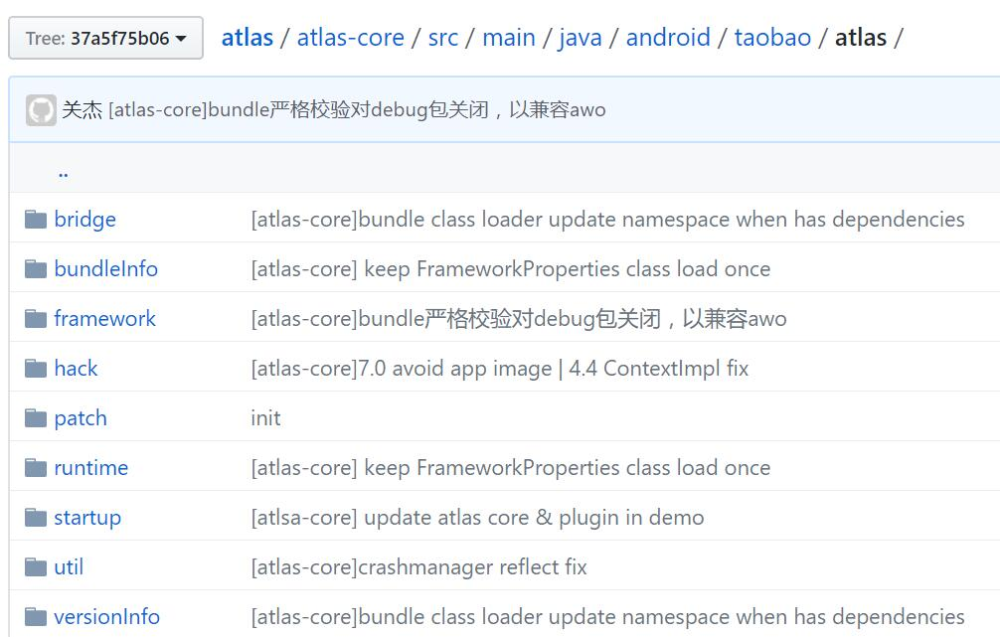

在taobao.atlas.runtime包中的一堆代码则主要是hook了Android系统，从而提供插件化的功能。插件化的框架多了去了，思路上也差别不大，主要都是尽可能无缝透明的解决四大组件和资源的问题。在这里简单的介绍一下Android动态加载常见的hook思路，而不仅仅局限于atlas框架。
- Activity的hook有好几种方式。比较常见的是使用预埋的策略，然后代理转发以模拟所有的生命周期和事件。不过本框架则是hook了像Instrumentation等稍微底层一点的类来实现的。其他的一些组件，是可以动态注册，因此是否hook可以根据业务的具体写法定了。如需hook，也可以采取类似Activity的方式。
- 资源的hook方案大体思路是很相似的。具体实现可能不同，可以用反射的方式直接替换掉mResources，也可以把多个resource合并起来。在本框架中，先使用了修改后的aapt进行业务的打包，从而保证了打包出来的资源id是全局唯一的（这就是aapt工程的用处）。然后再将资源反射注入。很常见的方式。

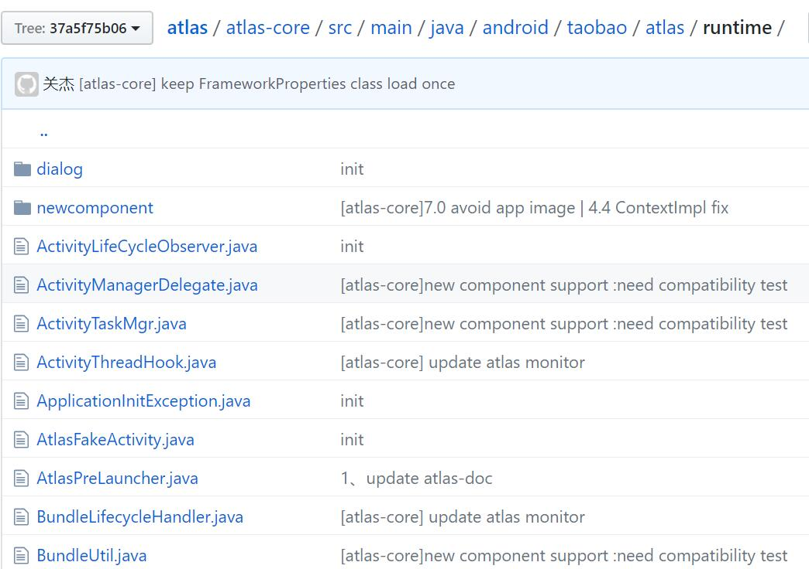  

概括来说，在插件化方面atlas并没有做什么特别的创新，其真正的价值在于使用OSGI的思想进行了真正意义上的模块解耦。当然，在了解atlas的设计理念的基础上，完全可以量身自定适合自己的组件化框架。
- 比如，将OSGI的classloader隔离部分去除，只保留其服务注册的思路，而不是将基础模块代码和管理模块代码直接打包在一起。业务代码在只依赖管理模块的时候，依旧能够调用到基础服务。在不使用反射的情况下，也能达到不错的隔离效果。
- 再比如，使用现有的插件化框架去替换掉atlas中的插件化部分，或者直接在已有的插件化上加上OSGI规范的具体实现，也能够有效的降低框架上手成本。

### 我需要组件化吗？
把一个框架做到实际运行起来并最终开源是有非常多的细节工作要做的。想要了解atlas所有的实现细节，看源码才是最快最可靠的方法。但衡量一个框架是否有实用价值并不需要知道所有的实现细节，了解实际的应用场景和框架的设计思想就足够了。因此，让我们来分析一下什么样的Android项目适合使用atlas吧。
- 有动态化需求且对性能要求较高的。如果只是动态化展示一些静态页面用web就足够了，atlas可以做到动态加载native代码，但成本略高。考虑手淘的场景，电商是很适用的，既会有大量的运营活动，也会经常动态上一些新业务或者功能，用web则达不到性能要求。
- 受困于组件解耦且难以解决的。只有大项目大团队，才会有组件解耦的必要，而且，越大的项目需求越强烈。另外，一旦团队大了，技术人员的水平是很难保证的。在这种情况下，指望所有人都按照文档或者规范来做事并不实际。手淘的团队当然非常大，因此atlas这种从技术角度强制隔离的就会体现出明显的价值来。
- 另外，atlas的投入是相当巨大的，不光需要大量的修改现有代码，投入人力去钻研框架，而且整套的CI系统也需要跟上。这并不是单纯客户都接入框架就可以工程化的。当然，atlas的远期回报很不错，只要设计维护好模块间的API接口，就能极大的减轻代码维护的工作量。
- 最后，值得一提的是著名的康威定律。Organizations which design systems are constrained to produce designs which are copies of the communication structures of these organizations. - Melvin Conway(1967)。直译过来大概就是设计系统的组织，其产生的设计等同于组织之内、组织之间的沟通结构。因此，是否有适合的组织结构也是问题之一。手淘是具备一个强有力的基础平台组和一大群小的业务组的。

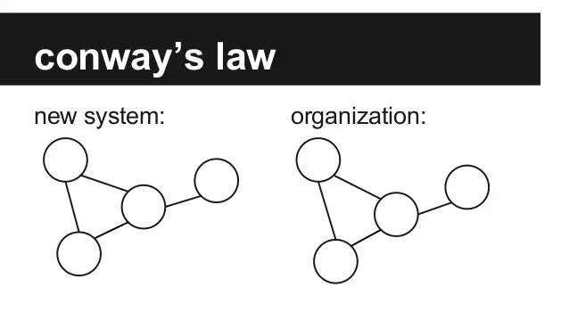

最终的结论是很简单的，即如果你
- 拥有百人以上的大团队在同做一个app且大家的水平参差不齐，
- 有着很大的code base，几十个模块间的依赖眼看就要难以管控，
- 对于动态化有着明确的需求场景，并对其性能有着较高的要求，
- 有一个强大的基础平台或者架构团队，以及很多个分散的业务团队，
- 能够说服公司投入足够多在代码质量和结构的改善提升上。

那么你应该试试atlas，或者说，试试使用OSGI+Android插件化的思路去支撑你的Android应用开发。
