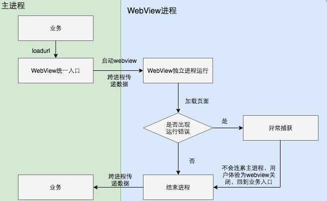

## Android WebView独立进程
本篇是WebView性能优化系列的第一篇文章，是针对Android平台所特有的简单粗暴的优化方案。
Android的WebView的崩溃数量相对于iOS平台来说，不是同一个数量级的。对于其中的很多问题，由于涉及到系统层面的代码，我们缺少有效的手段去予以修复。同时像是长图文等导致的内存溢出，我们也缺少有效的方式去予以规避。  

  独立进程方案就是在此种背景下诞生的。
- - -
### WebView的问题
- 网页代码质量不可控  
很多时候，网页的代码并非全部由己方完成，部分页面是由外部厂商提供，比如广告，跳转链接等。因此，即使我们找到了问题所在，也无法令其修改，代码质量是难以保障的。举个例子，从下面的log，我们可以看出，mgtv直接将开发代码放到了正式环境，而这段代码还需要去github去下载vue-devtools，最终timeout导致页面加载不完全。显然，我不是mgtv的员工。。。

      05-21 21:46:49:405 14023 14023 D The key "minimal-ui" is not recognized and ignored. -- From line 6 of http://m.mgtv.com/#/b/292390/3306125?cxid=9571sxdjy&deviceId=61162a48cf51cb6839dc1409c7360dbb&qyid=868819022170454&platform=GPhone&network=1&ov=4.4.3&location=118.196877,24.526222&src=android&ref=  
      05-21 21:46:50:374 14023 14023 D Download the Vue Devtools for a better development experience:https://github.com/vuejs/vue-devtools -- From line 24 of http://m.mgtv.com/js/app.4a882c4395b3165ee051.js?523b2815ac91b66250ea  
      05-21 21:46:50:637 14023 14023 D create messenger -- From line 6 of http://m.mgtv.com/js/playpage.bac6d8fd90af0de86ca9.js
- WebView本身问题较多  
WebView本身是存在不少bug的，google一直在进行积极的修复工作中，甚至在4.4之后换过一次内核。但由于系统版本碎片化严重，很多用户升级不及时，因此依然影响很大。Java和Native的崩溃中都包含了大量WebView相关的崩溃，除此以外还有OOM问题。例如，在Android 4.1.2的版本中，就有如下已知问题。  
这个问题在我们现在的崩溃日志中依然每天都能见到。
```
      java.lang.IllegalArgumentException: bad parameter
      at org.apache.http.client.utils.URLEncodedUtils.parse(URLEncodedUtils.java:139)
      at org.apache.http.client.utils.URLEncodedUtils.parse(URLEncodedUtils.java:76)
      at android.webkit.AccessibilityInjector.getAxsUrlParameterValue(AccessibilityInjector.java:412)
      at android.webkit.AccessibilityInjector.shouldInjectJavaScript(AccessibilityInjector.java:327)
      at android.webkit.AccessibilityInjector.onPageFinished(AccessibilityInjector.java:286)
      at android.webkit.WebViewClassic.onPageFinished(WebViewClassic.java:4088)
      at android.webkit.CallbackProxy.handleMessage(CallbackProxy.java:332)
      at android.os.Handler.dispatchMessage(Handler.java:99)
      at android.os.Looper.loop(Looper.java:137)
      at android.app.ActivityThread.main(ActivityThread.java:4829)
      at java.lang.reflect.Method.invokeNative(Native Method)
      at java.lang.reflect.Method.invoke(Method.java:511)
```
- Android厂商自行修改  
Android厂商的兼容性问题严重，在特定厂商的特定版本上会有难以解决的问题。这类问题通常是用于厂商擅自修改源码，且未严格进行测试导致的。相信任何一个Android开发，都有过适配不同厂商的经历，这里仅针对WebView的问题举两个例子：  
  - 某天的WebView的native崩溃的数据如下: libwebviewchromium.so总崩溃数为89920次。其中，VIVO占70950(78.98%)，OPPO占15281(17.01%)。5.1.1系统占59530(66.2%)，5.1系统占24877(27.67%)。可以看出，崩溃非常集中的分布在o/v手机的5.1和5.1.1版本。

  - 今年4月的某天的崩溃数据显示，乐视手机突然出现了大面积的崩溃，没有任何先兆。调用栈显示WebView中调用了SQLite的相关操作并崩溃，但在Android源码中并未发现有此段代码。最后，在乐视的官方论坛上发现，乐视于崩溃前一天发布了新版本的Rom。
- - -
### 具体方案
Android WebView独立进程是指在WebView加载具体页面时，独立运行在自身的进程中，不与app的主进程在一起。在业界，这是一个非常通用的解决方案，有大量的资料可供参考和借鉴。通过这种方式，隔离了WebView的运行环境，保证了其不稳定性不会影响到主程序。用户对此的感知主要是

由于Android本身支持App运行在多个进程中，因此，独立进程的方案实现较简单，只需要在AndroidManifest中找到对应的WebViewActivity，对其配置"android: process"属性即可。    

重点需要注意的是跨进程数据传递和调用的处理，如果有js代码的注入，需要检查其是否可以正常跨进程的运行。

独立进程方案流程如下：  


- - -
### 分析

- 在上线之前的版本，WebView的每日崩溃数约为9-11万次，在整体崩溃中的占比也较高。

- 上线的时候，挑选了第三方厂商提供的广告页面进行了独立进程改造，从而避开了js注入导致的跨进程调用问题。

- 上线后，每日的WebView总崩溃数约为8-10万次。 其中，大约5万次左右的崩溃在独立的进程中发生，从而很好的保障了用户体验。

- 本质上，独立进程是个治标不治本的方法，并且也不是所有场景都适用。对于内部提供的页面，涉及到较多逻辑封装，跨进程改造会有较高的成本。采用第三方内核是更值得考虑的方案，比如接入腾讯的x5内核。

### 总结
独立进程的思路其实无论在苹果还是谷歌，都已经有了进一步的发展。
- 苹果官方推出的用以取代UIWebView的WKWebView，就是运行在独立进程中的。从而起到降低内存消耗，保证主进程稳定的作用。
- 谷歌在Android7.0中推出了"多进程WebView"这一选项，在开发者选项中即可打开。选项开启后，WebView即会在独立的进程中运行，启动隔绝的效果。  

可见，由于网页本身的复杂程度，即使谷歌和苹果也无法通过纯技术手段解决效率，内存占用，崩溃等问题。因此，独立进程是一个非常重要的WebView优化方案。
