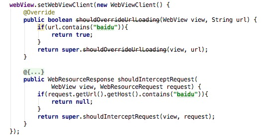
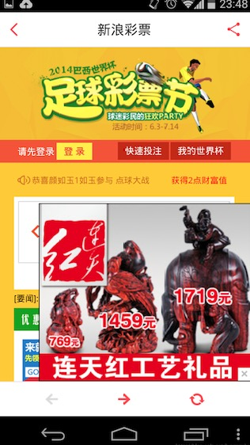
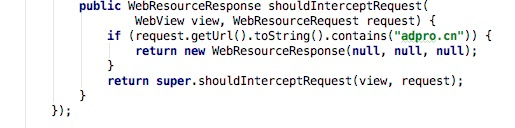
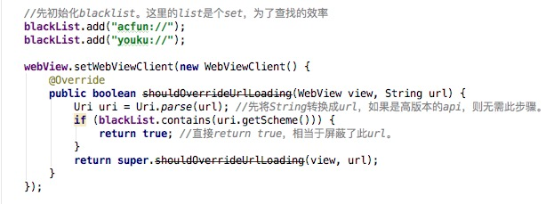

## 黑名单机制
本篇内容会介绍WebView优化中很常见的一个方案————黑名单过滤机制。在Android的WebViewClient中，有两个这样的回调：
- shouldOverrideUrlLoading：用以获取将要访问url，比如加载网页时的url。
- shouldInterceptRequest：用以获取网页内部发起的资源请求，比如网页引用的css文件，js文件，图片等。  

通过重写这两个回调，我们可以自由的控制WebView的访问，屏蔽不想访问的链接。
黑名单机制是指在WebView打开网页的过程中通过黑名单列表过滤掉禁止打开的页面，从而提高App的安全性。除此以外，在客户端也可以通过黑名单拒绝一些通过scheme发起的操作。  

举个简单的例子，屏蔽往baidu的跳转，代码中判断一下是否含有"baidu"这个关键字就好了。
  

  可以开始实战了，让我们来看看黑名单机制能做哪些事情吧。

### 运营商弹出广告屏蔽
大家应该都有过这样的体验：接入了某些网络后，会弹出一些莫名其妙的链接。在windows电脑上特别常见，在手机设备也不少见，如下图所示：  
  

这个问题发生的原因是用户的网络请求被接入的网络有意无意善意恶意的篡改了一下，访问了某些不该访问的网址。那么针对这个特定的链接，我们就可以直接把它屏蔽掉。通过log，我们知道了这个广告的地址，并猜测这类的广告都放在了"adpro.cn"这个站点上，所以我们屏蔽了对这个站点的所有访问。如下所示：
  

用这种方式，我们就可以自由的屏蔽不想访问的网页链接或者网站域名。
### 拦截跳转第三方App
另外一个常使用黑名单的场景来自于现实的需求。某一天上班的时候，领导告诉我：`我想在我的app里访问别人的网站，但是我不想从这个页面里去启动他们的app，这个快抓紧做一下，这期要上。`    
本着面向领导编程的思想，自然要去调研一下啦。先看下实际场景，是这个样子的，点击中间的按钮就会拉起对应的App的。我们要做的就是屏蔽掉这个拉起行为，点击没反应就好了。  
  

在Android系统里，可以在AndroidManifest里注册想要处理的scheme。当有此scheme发出来的时候，系统就会唤醒对应的App。通过log，发现点击这个按钮发出的scheme是"youku://..."。因此，处理一下scheme就好了，代码实现如下：

### 小结
黑名单过滤是WebView优化中最常见的也是最基础的方式，专门用以屏蔽不想访问的链接。在下一期中，将介绍与之相对应的一个机制，即白名单列表。
