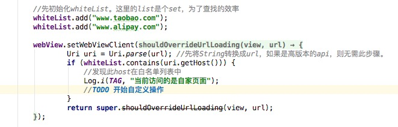
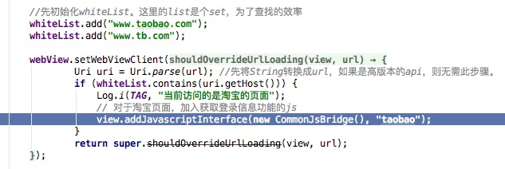
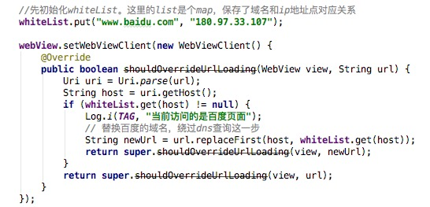

## 白名单机制
上一篇文章中，我们介绍了针对WebView的黑名单机制。对于特定的域名，我们可以通过配置黑名单列表从而在WebView中对这些域名进行拦截或其他操作，从而改变对此地址的正常访问。  
这一篇文章中，我们将介绍与黑名单对应的一个机制——白名单。从代码实现角度，白名单与黑名单是非常相似的。但从出发点来说，黑名单是为了禁止或者屏蔽某些访问而白名单则是为了增加允许更多的操作。  
一个简单的实现如下：

  下面我们将列举两个常见的使用白名单的场景。

### javascript注入
javascript注入是最为常见的使用到白名单的场景。对于一款混合开发的app来说，H5页面的功能不仅仅是单纯的静态页面展示，也会肩负着一些用户交互的功能。  
常见的需求包括但不限于：
- 调用app自定义的对话框和Toast
- 调用摄像和照相选择
- 调用第三方分享
- 调用登录功能并获取用户登录信息    

但是，出于安全考虑，我们是不可以把这些功能暴露给所有h5页面的，比如取用户登录信息这种敏感数据。这个时候，白名单就派上用场了。对于某些特定域名下的网址，我们认为是可以暴露的，比如己方或者友商开发的h5页面。  
举个例子，如果要获取手机淘宝的用户登录信息，那么应该只允许淘宝自己开发的h5页面。所以，通过白名单，只要是淘宝站上的网页，我们才允许注入js。  
大概的代码示例如下：

### 域名防劫持
域名劫持是做移动端开发很容易遇到的事情，甚至比pc时代更为常见。面对这样的情况，我们可以通过使用白名单机制进行域名的替换从而进行回避。  
代码示例如下：

