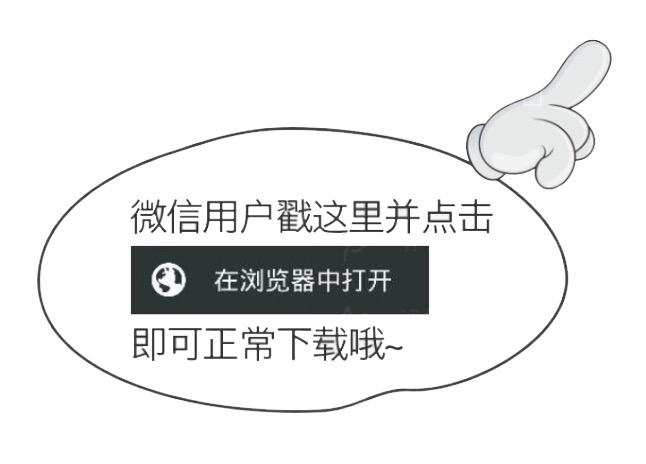
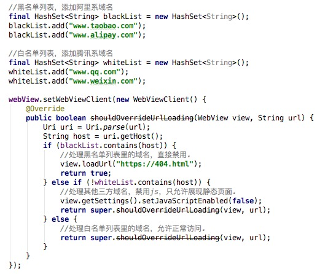

## 白名单机制
在上一篇文章中，我们介绍了WebView优化中的黑名单机制。对于特定的域名，我们可以通过配置黑名单列表从而在WebView中对这些域名进行拦截或其他操作，从而改变对此地址的正常访问。  
在这一篇文章中，我们将介绍与黑名单对应的另一个WebView优化机制————白名单机制。  
白名单是通过名单列表过滤出一组域名或者网址来，随后对其进行一些操作。一段简单代码实现如下：  

  下面我们将列举三个常见的使用白名单的场景。

### javascript注入
javascript注入是最为常见的使用到白名单的场景。对于一款混合开发的app来说，H5页面的功能不仅仅是单纯的静态页面展示，也会肩负着一些用户交互的功能。  
常见的需求包括但不限于：
- 调用app自定义的对话框和Toast
- 调用摄像和照相选择
- 调用第三方分享
- 调用登录功能并获取用户登录信息    

出于安全原因，我们是不可以把这些功能暴露给所有h5页面的。比如取用户登录信息这种敏感数据的接口，就应该只能是自己开发的页面才可以使用。在这种场景下，白名单就派上用场了。对于某些特定域名下的网址，比如己方或者友商开发的h5页面，我们就可以为其暴露更多的js接口从而提供更多的交互功能，其他来源的页面则只允许静态展现。  
举个例子，如果要获取手机淘宝的用户登录信息，那么应该只允许淘宝自己开发的h5页面具有此功能。所以，通过白名单，只有淘宝站上的网页，我们才允许注入js。  
简要的代码示例如下：  

### 域名防劫持
域名劫持是做移动端开发很容易遇到的事情，甚至比pc时代更为常见。面对这样的情况，我们也可以通过使用白名单机制进行域名的替换从而进行回避。  
代码示例如下：  

### 访问限制
有些时候，我们需要对网页的访问做出一些限制，而且这种限制有时候并不是简单的分为可以或不可以两类。以大家熟悉的微信为例，有些网址根本就是不允许打开的，有些网址是可以打开但是不能运行任何js代码的，还有一些网址则是可以正常访问的。比如类似下图的这种，大家一定都见过。  

  

面对这种情况，我们可以混合使用黑名单和白名单，从而达到对网址的访问控制。代码示例如下：  

### 总结
白名单机制的核心思想就是通过在进行网址访问前，通过白名单列表的过滤，获取一组域名或网址。对于这样一组域名或网址，我们可以赋予其特殊的能力。  
从代码实现的逻辑来看，白名单与黑名单是非常相似的，都是通过过滤域名从而做一些事情。但从意图来讲，黑名单是为了禁止或者屏蔽某些访问而白名单则是为了增加允许更多的操作。  
