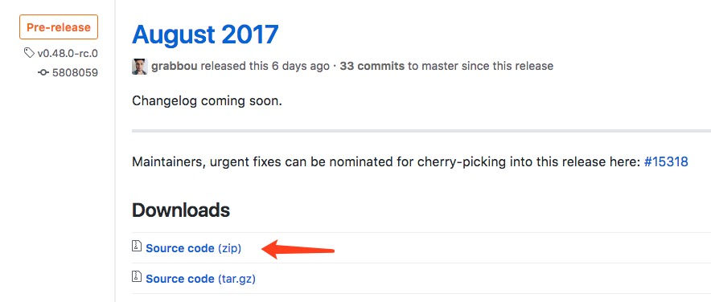
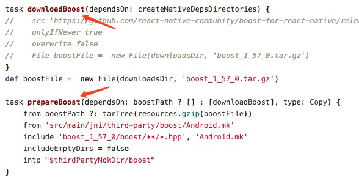
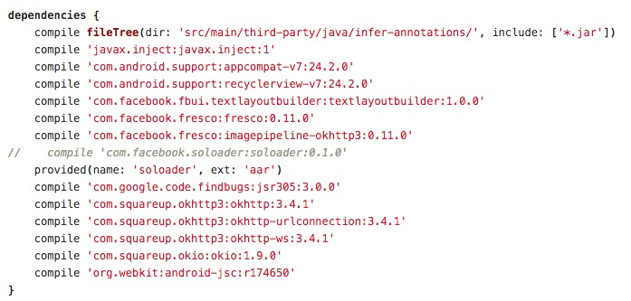
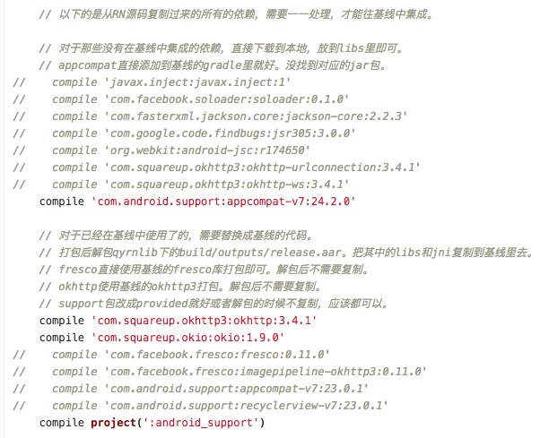

## Android RN集成步骤
相比于iOS平台，Android平台的集成要复杂一些。主要原因在于React Native For Android本身依赖了大量第三方的库，比如fresco, okhttp等。因此，对于一些已经有一定规模的工程，想要集成React Native框架，只能手工去一个个检查，对齐并补全相关的依赖库了。

### 源码获取
首先，从工程角度，直接依赖线上的包会带来一些的不可预计的问题。因此，我们的第一步自然就是获取RN的源码，并从本地的源码打包。
- 从react native的github地址选取稳定版本的[release](https://github.com/facebook/react-native/releases)，在release note的底部有下载源码的链接。通常来说，最新的版本越稳定，接口特性越丰富，性能表现也越优异。  

- 解开压缩包后，会看到ReactCommon和ReactAndroid文件夹，以及编译相关的gradle文件。其他的文件基本与Android打包没太大关系，可以考虑删除。

### ndk处理
RN的ndk部分，依赖了一些常见的库，需要进行适当修改，以防止冲突。同时，我们可以通过一些简单的处理，来解决翻墙问题并大幅提高打包速度。
- 查看ReactAndroid/build.gradle文件。里面有一堆so相关的task。这些task通常分为download和prepare两步，具体如下图所示：  

- 针对download的task，可以手动下载这些task里所指定的lib。目前包括boost, jsc, double-conversion, folly和glog。有些下载的网址链接网速很慢甚至根本访问不到，这时候就可以靠国内镜像或者百度来解决了。
- 然后，将这些lib放到ReactAndroid/build/downloads路径下（配置文件中默认的ndk打包路径，可以修改配置参数），就可以注释掉build.gradle中的download相关task，只留下prepare的部分了。再备份一下这些so库，这样即使不小心clean了以后，也能迅速开始打包，无需重新下载了。
- 处理完这些，就可以使用RN指定的ndk版本进行打包了。(ndk的兼容性一直堪忧，请务必使用rn官方说明的ndk版本，并不是越新越好的)  

特别要注意的是，rn默认打包出来的so分别为armeabi-v7a和x86。如果你的app不是armeabi-v7a的，则不能直接使用，而x86大部分也是多余的。该怎么处理会在后面介绍到。

### 处理Java依赖
Java部分的代码主要集中在ReactAndroid文件夹内，尤其是所有的gradle脚本。这就是要重点关心的地方了，改动量也会大一些。0.41版本的依赖关系如下（最新的版本可能某些库有更新）：  

通常情况下，应该是升级或者降级主App的依赖版本来对齐RN的依赖，这样子就可以不改动RN的源码。但是对于某些结构不好的工程，改动主App来适应RN有着不可估计的工作量，因此只好改动RN源码。无论如何适配，主要关注的点如下：
- 网络问题。。。老样子，并不是任何地方的网络在任何时间都是通畅的。还是下载下来，然后从在线依赖改为本地依赖吧。
- 接口不一致问题。。。比如fresco的版本，不同的版本接口就可能会不一致。再比如okhttp3，直接把okhttp2的名字都换了。
- 包本身的问题。。。okhttp3在一开始版本中没有包含okhttp-ws，后来则包含了。

### 依赖替换
在分析了公司的主App的依赖情况后，可以简单的把依赖分为两个部分。一部分是主App还没有依赖的，还有一部分是已经依赖过的。具体的处理方式如下：
1. 对于inject, soloader, jackson-core, jsr, jsc这些没有依赖过的库，下载网络上的公共版本即可。由于soloader和jsc是aar包，且没有资源文件。因此将其解压缩，拆包，分别将jar和so放入libs中，这样比较省事。
2. 对于support-v7,recyclerview-v7,fresco, imagepipeline, okhttp, okhttp-urlconnection, okio, okhttp-ws这些已经依赖了的，则要替换所有的依赖关系为主App提供的本地依赖。

rn框架最终运行是在主App的环境中，因此在打包框架前就使用主App的依赖，可以及早发现兼容性问题。一张改过后的图大致如下，仅供参考，实际集成需要根据自身情况来：  

### 打包集成
经过了这么一系列的预处理，终于可以进行框架打包了。具体的操作步骤如下：
1. 根据官方的说明，在ReactAndroid工程目录下运行gradlew build。这是一个普通的android工程打包过程。
2. 来到build文件下，在最终的output目录中找到ReactAndroid-release.aar。
3. 公司的主App的so全部都放在了armeabi目录下，因此与RN的so路径有所冲突，需要处理。简单粗暴的做法是
 - 把aar解压到文件夹。
 - 把其中的armeabi-v7a这个目录重新命名为armeabi。
 - 删除多余的x86目录。
 - 把文件夹重新压缩，并把后缀由zip改为aar。
4. 在主App中建立一个名为React的工程，并让主App依赖此工程。
5. 在此工程中放入刚才得到的rn框架的aar包并配置好依赖，并将所有不存在的依赖全部加入这个工程中。以我司为例，就是把inject, soloader, jackson-core, jsr, jsc这些原本不存在的依赖全部加入并在build.gradle中配置好依赖。

到此，主App集成Android RN框架的工作就全部完成了。主App已经具备了运行RN的能力了。
