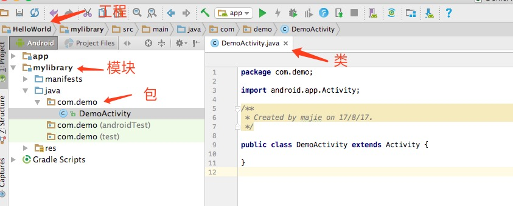
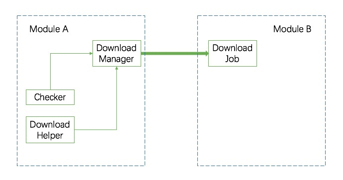
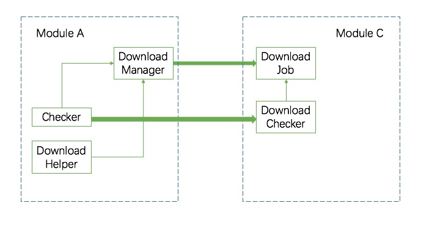

## 漫谈Android组件化

### Java特性
在Java中，有两个非常重要且被广泛使用的东西，分别是classloader和四大修饰符关键字。
- 使用classloader来加载类。不同classloader中的类是互相隔离的。通常，每个工程会有一个自己的classloader。
- 使用public和protect关键字来管理包之间的代码。public代表全局可见,protect表示子类可见。
- 使用default关键字来约束包内的代码，只有同一个包内的类之间代码互相可见。
- 使用private关键字来约束类内部的代码，只有本类的内部的代码才可见。

  

基于这两个特点，Java应用的工程结构可以被划分为三种基本单位，自上而下依次是应用(application)、包(package)、类(class)。Java语言通过classloader的加载机制来隔离类，并通过四大修饰关键字来管理代码级别的可视关系。

不过，随着工程水平的进步，大型项目日益增多，基于Java语言特性的三种基本单位变得有些不太够用了。很多时候会出现这样一种情况，一个人负责好几个包的代码，但同时又有多个人协作同一个工程的情况。为此，程序员们人为的在应用和包之间加入了第四个结构上的概念——模块。  
在一个大规模的应用/系统中，模块成为了真正被管理和部署的单元。每个模块一般都会有自己的owner，并进行相对独立的迭代和演进。以模块为核心的进行人员分配和管理，正是现在大多数应用开发所遵循的原则。

### Android工程结构
打开Android Studio，我们会发现Android工程已经提供了四个层级的管理单位：分别是工程(project)、模块(module)、包(package)和类(class)。  

  

在一个大的Android工程中，
- 模块是基本的功能单元。因为，模块间通常会按照功能进行划分，每个模块都会有自己比较特定且专一的功能。
- 模块是独立的迭代单元。因为，模块通常会被进行细致的设计和划分以保证模块间的关系通常较为独立，可以独立的进行更新。
- 模块是基础的维护单元。因为，模块通常会由特定的一个人或一小组人负责。  

下面这幅图解释了这四种单位的关系。我们可以看出模块的意义何在。

### 模块的困境
从概念上，模块是很好理解的，也很容易被划分出来。然而，Java语言不具备原生支持模块概念的能力。因此，在实际工程中，我们经常会出现模块间耦合度过高，互相甚至循环依赖，无法独立迭代，维护困难等问题。  

假设有一个App，会大量的使用到文件下载的功能。对于一个稍大的团队，很可能会这么去做：
- 先划分出一个单独的文件下载模块A，并指派专人负责其代码，以方便复用和维护。
- 为了方便别人调用，A模块实现了下载的统一管理类DownloadManager，提供了download(...)的方法，并用文档标明了使用方法。
- 因为下载本身是一系列的步骤，因此需要一系列的Helper类。比如，有个DownloadHelper类，提供了一个public方法startDownload(...)。还有一个Checker类，提供public的方法canDownload(...)。
- 模块B需要调用A的功能时，查看了A模块提供的说明文档。因此正确使用了DownloadManager.download(...)方法。

目前看来，划分模块的思路很清晰很准确，一切都运转良好。但是，没有一种原生的Java机制可以防止别的模块看见模块A的其他public方法。考虑下面这么个场景：
- 有个模块C，也想调用模块A的下载功能，也是需要先用check

